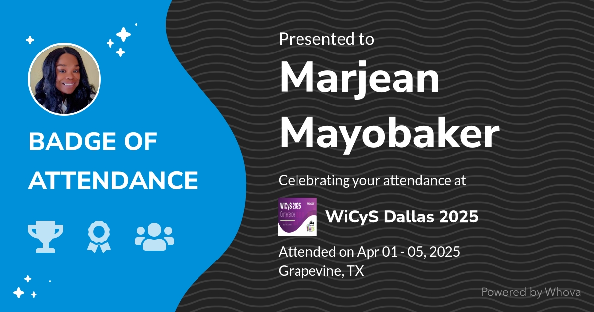
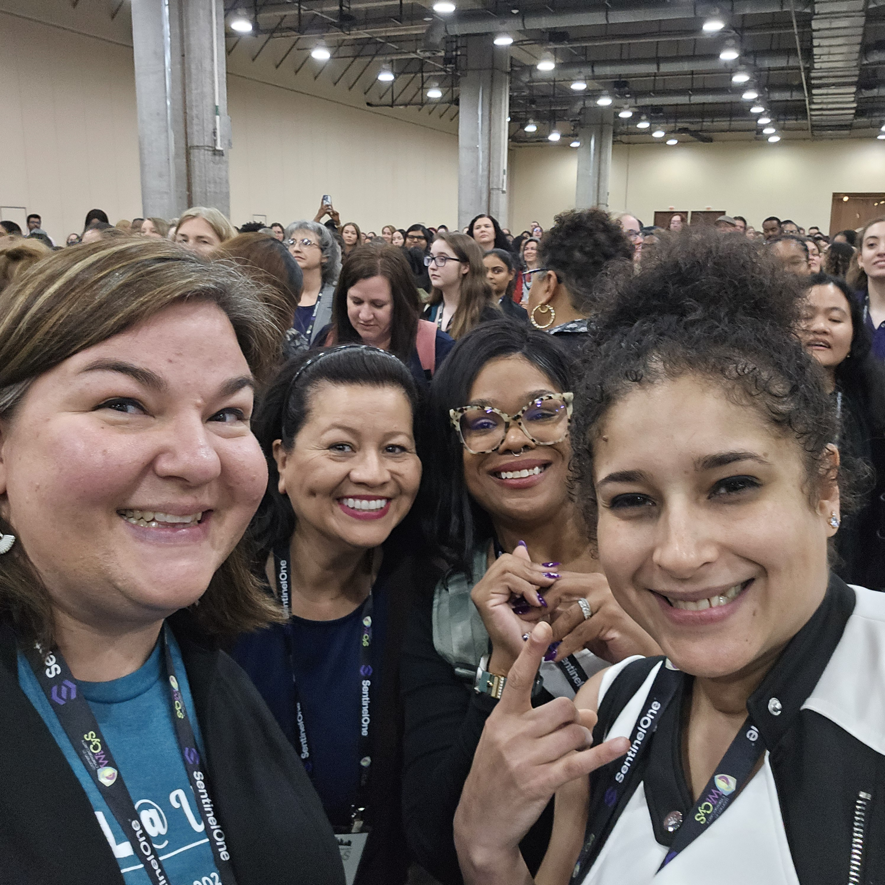
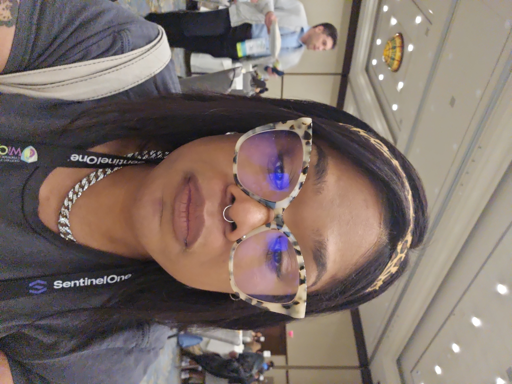
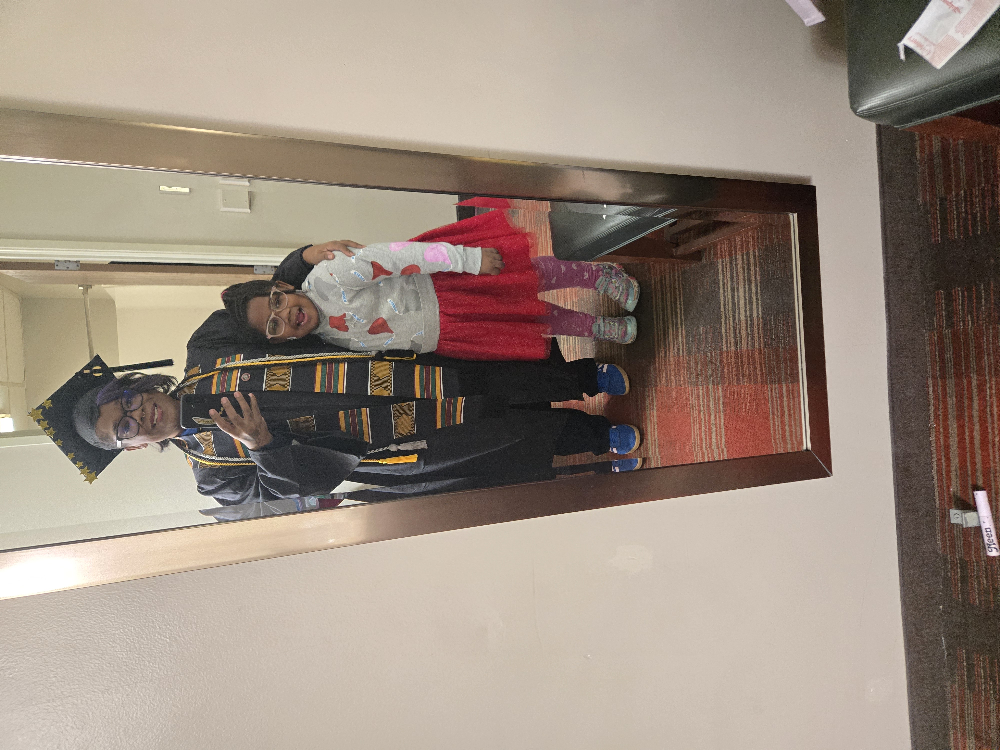
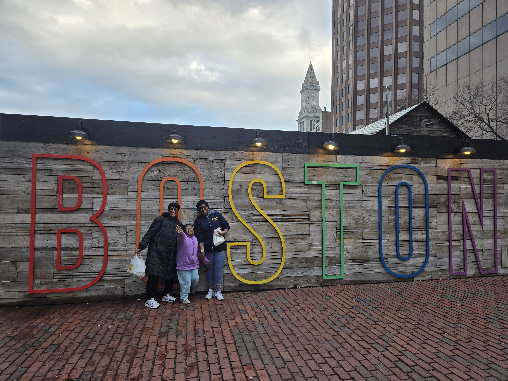
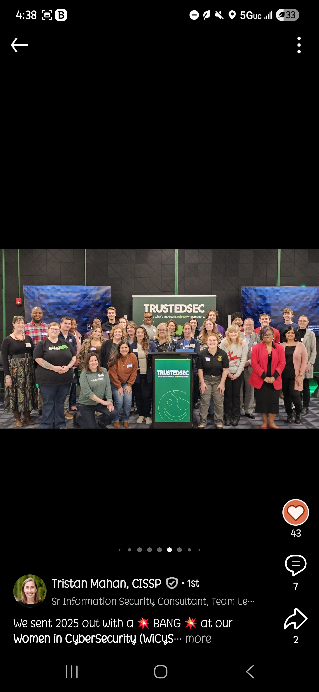
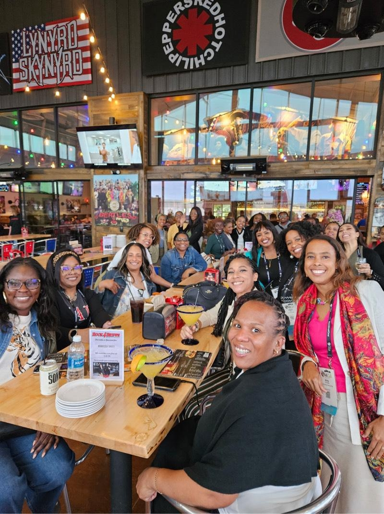
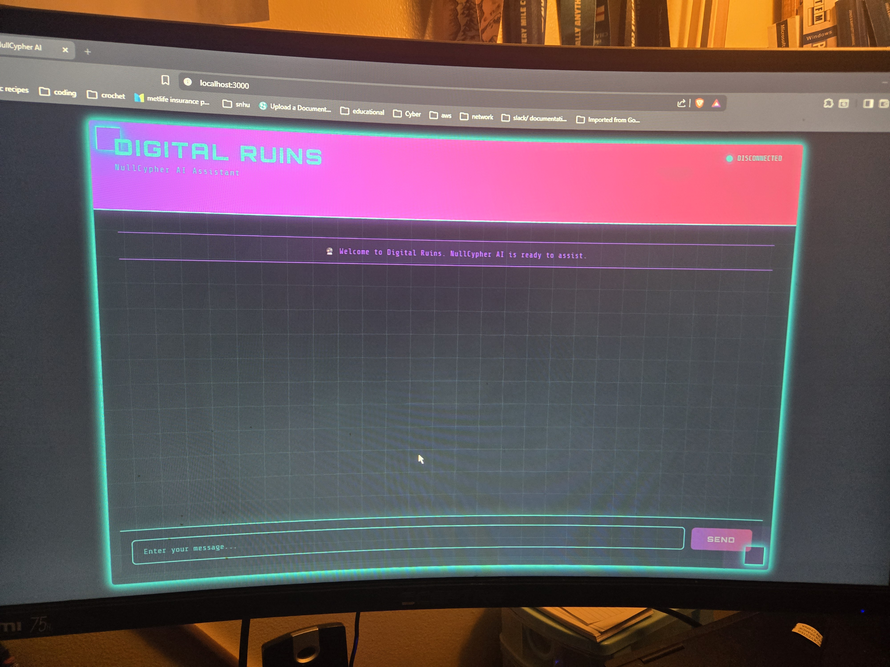

## **Digital Ruins -  SIM**

Your underground lab for governance sims, MFA rollouts, and real-world incident playbooks.

> **Signal > Noise.**  
> Cyberpunk spine, audit-ready polish.

- :material-shield-key-outline: **MFA Ghost**
    ---

    Entra ID rollout, phased by risk tier with Conditional Access and governance.
    [:octicons-arrow-right-24: Open](governance/SIMs/MFA_Ghost/README.md)

- :material-alert-decagram-outline: **Shiny Trust Breach**
    ---

    Google/Salesforce breach simulation: timeline, exec brief, AI risk clause, onboarding SOP.
    [:octicons-arrow-right-24: Open](governance/SIMs/Shiny_Trust_Breach/README.md)

- :material-account-alert-outline: **Trust Betrayal (SOC Escalation)**
    ---

    Escalation pathing, lessons learned, and corrective controls.
    [:octicons-arrow-right-24: Open](governance/SIMs/Trust_Betrayal/README.md)

- :material-account-question-outline: **Human Failure Vector**
    ---

    People-layer risks and mitigation patterns.
    [:octicons-arrow-right-24: Open](governance/SIMs/Human_Failure_Vector/README.md)

---

## :material-presentation: Past Talks & Speaking Events

**RAFA Academy Presentation** — Speaker on cybersecurity governance, AI hygiene, and security frameworks.

[:material-download: Download Speaker Deck](assets/presentations/speaker.pptx){ .md-button .md-button--primary }

### Event Gallery

  

    
    
    
  

  

    
    
    
    
  

  

    
    
    
  

---

## :material-account-voice: Speaking Engagements

!!! note "Request a Talk"
    Interested in having me speak at your event or organization?

    **Topics I cover:**

    - :material-shield-lock: **AI Hygiene & Security** — Practical controls for AI adoption
    - :material-account-alert: **Governance & Risk** — Building audit-ready frameworks
    - :material-security: **Incident Response** — Real-world playbooks and lessons learned

    [:octicons-mail-24: Contact me](mailto:marjean@thedigitalruins.com){ .md-button .md-button--primary }

---

## :material-robot-outline: AI Chatbot Project

!!! info "Custom AI Assistant"
    I've developed a specialized chatbot for governance and security workflows.

    Curious about the architecture, use cases, or deployment? **Drop me an email** — I'd love to discuss it.

    [:octicons-mail-24: Ask me about it](mailto:marjean@thedigitalruins.com){ .md-button }

---

## :material-school-outline: Education & Honors

- :material-trophy-outline: **Summa Cum Laude Graduate**
    ---

    { width="100%" }

    Graduated with highest honors, demonstrating dedication to academic excellence and commitment to the field of cybersecurity.

- :material-certificate-outline: **Master's Degree (In Progress)**
    ---

    Currently pursuing advanced studies in cybersecurity and information systems, building the foundation for real-world governance and risk management.

---

## :material-email-outline: Contact Me

!!! tip "Get in Touch"
    Whether you're interested in collaboration, speaking engagements, or just want to discuss cybersecurity and governance:

    :fontawesome-solid-envelope: **marjean@thedigitalruins.com**

    :fontawesome-brands-linkedin: [Connect on LinkedIn](https://linkedin.com/in/YourLinkedInUsername){ target=_blank rel="noopener" }

    :fontawesome-brands-github: [View my work](https://github.com/marjeanm){ target=_blank rel="noopener" }

---

## :material-post-outline: Latest from the Blog

- :material-shield-lock: **Post-2024 Privacy — What Changed & What You Can Do**
    ---

    State laws snapshot, accountability gaps, and a 10-step action list.
    [:octicons-link-external-24: Read](https://blog.thedigitalruins.com/2025/09/analyzing-state-of-privacy-in-post-2024.html){ target=_blank rel="noopener" }

- :material-account-voice: **Social Engineering — Tactics & Defenses**
    ---

    Baiting, impersonation, SPIT/vishing, plus a 30-second verification playbook.
    [:octicons-link-external-24: Read](https://blog.thedigitalruins.com/2025/09/social-engineering-understanding-tactic.html){ target=_blank rel="noopener" }

- :material-shield-key-outline: **Web App Security — BAC & Auth Failures**
    ---

    Deny-by-default, ABAC/ReBAC, passkeys/MFA, lockouts, and session hygiene.
    [:octicons-link-external-24: Read](https://blog.thedigitalruins.com/2025/09/mitigating-web-application-security.html){ target=_blank rel="noopener" }

[Visit the full blog](https://blog.thedigitalruins.com){ .md-button .md-button--primary target=_blank rel="noopener" }
