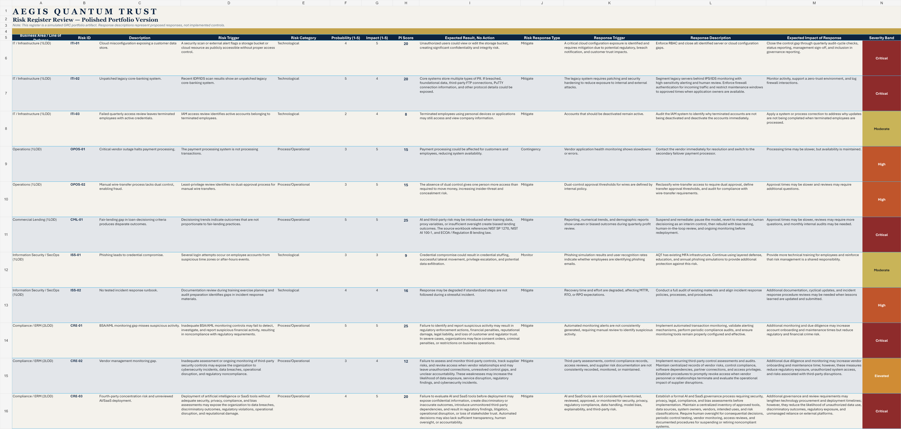

<article class="dr-case-study" markdown>
  <header class="dr-case-header">
    

      
Flagship Case Study // Risk Management

      <h1>Enterprise Risk Register</h1>
      
Turning a mixed field of cyber, operational, vendor, fourth-party, AI/SaaS, and compliance concerns into a register leaders can prioritize and auditors can follow.

    

    
AvailableSimulated / academic artifact

  </header>

  <nav class="dr-jump-nav" aria-label="Case study sections">
    <a href="#overview">Overview</a><a href="#scenario">Scenario</a><a href="#objective">Objective</a><a href="#my-approach">My Approach</a><a href="#frameworks--methods">Frameworks &amp; Methods</a><a href="#key-findings">Key Findings</a><a href="#artifact-preview">Artifact Preview</a><a href="#view--download-artifact">Artifact Access</a>
  </nav>

## Overview

This flagship project demonstrates how I structure enterprise risk information for action. The published workbook contains **11 simulated enterprise risks** across technology and process/operational categories. It connects risk statements, probability and impact, business effect, response strategy, trigger conditions, proposed response, and expected treatment impact.

## Scenario

The fictional enterprise relies on cloud platforms, third parties, and AI-enabled SaaS while operating under security, availability, privacy, and compliance expectations. Leadership needs a consistent way to compare risks that arrive from different parts of the business without flattening the context that makes each risk meaningful.

### Aegis Quantum Trust

> Aegis Quantum Trust is a fictional enterprise environment used across selected portfolio projects to demonstrate governance, risk, compliance, audit, security, and AI governance decision-making in a consistent business context.

AQT is the scenario environment for this artifact. It is not the brand or identity of The Digital Ruins.

## Objective

Create an enterprise risk register that helps stakeholders prioritize treatment, identify accountability, and maintain an audit-ready record of why a response was selected.

## My Approach

1. Defined risk statements in cause–event–impact language.
2. Grouped risks into operationally useful domains without treating categories as silos.
3. Applied a consistent probability-impact method to support comparison and retained formula-driven PI scores.
4. Documented current exposure, proposed response, ownership, dependencies, and evidence needs.
5. Elevated fourth-party concentration and AI/SaaS use where they changed the organization’s actual risk boundary.
6. Added an executive dashboard, severity bands, and controlled public-facing polish without adding risks or changing their business meaning.
7. Reviewed the register as a decision document: readable by leaders, traceable by assurance teams, and actionable by control owners.

## Frameworks & Methods

- Probability-impact scoring on a 1–5 scale, calculated as probability × impact
- Severity bands: Low (1–4), Moderate (5–9), Elevated (10–14), High (15–19), and Critical (20–25)
- Risk response options: mitigate, transfer, avoid, and accept
- Cause–event–impact risk statement construction
- Control and evidence mapping
- Third- and fourth-party dependency analysis
- AI/SaaS data-governance review
- Audit-ready ownership and treatment tracking

## Key Findings

- **Five risks fall in the Critical band** and eight are High or Critical, concentrating attention on fair-lending decisioning, BSA/AML monitoring, cloud exposure, legacy infrastructure, and unreviewed AI/SaaS deployment.
- The register contains **five technological risks** and **six process/operational risks**, showing that enterprise cyber exposure is not only a technical problem.
- Nine of the eleven entries use a Mitigate response; the vendor-outage scenario uses Contingency and the phishing scenario uses Monitor.
- Vendor review is incomplete when fourth-party concentration and material dependencies remain invisible.
- A score supports prioritization, but triggers, response rationale, business impact, and evidence make the register operational.

## What This Demonstrates

This project demonstrates risk analysis, business-impact translation, structured documentation, vendor and fourth-party thinking, AI governance awareness, remediation planning, and the ability to make a risk artifact useful to both decision-makers and reviewers.

## Artifact Preview

The preview below uses the published workbook’s actual risk IDs, scores, severity bands, and response types.

  
<strong>11</strong>Total risks

  
<strong>05</strong>Critical risks

  
<strong>08</strong>High + Critical

  
<strong>09</strong>Mitigate responses

| Risk ID | Selected risk theme | P | I | PI | Band | Response |
| --- | --- | ---: | ---: | ---: | --- | --- |
| CML-01 | Fair-lending gap in loan decisioning | 5 | 5 | 25 | Critical | Mitigate |
| CRE-01 | BSA/AML monitoring gap | 5 | 5 | 25 | Critical | Mitigate |
| CRE-03 | Fourth-party concentration and unreviewed AI/SaaS | 4 | 5 | 20 | Critical | Mitigate |
| ITI-01 | Cloud misconfiguration exposing customer data | 4 | 5 | 20 | Critical | Mitigate |
| ISS-02 | No tested incident-response runbook | 4 | 4 | 16 | High | Mitigate |
| OPOS-01 | Vendor outage halts payment processing | 3 | 5 | 15 | High | Contingency |

<figure class="dr-artifact-preview">
  
  <figcaption>Authentic workbook preview. Open the image for the full-width register view.</figcaption>
</figure>

## View / Download Artifact

  

    
Public artifact

    <h3>Branded Enterprise Risk Register</h3>
    
Download the source-backed Excel workbook with the portfolio summary, register, response reference, executive dashboard, heat map, and top-priority view.

  

  
<a class="dr-button dr-button--primary" href="../../assets/artifacts/AQT_Enterprise_Risk_Register.xlsx" download>Download XLSX</a><button class="dr-button" type="button" onclick="window.print()">Print Case Study</button>

## Source Note / Disclosure

This case study and downloadable workbook are based on academic, simulated, and portfolio work. AQT is fictional. The workbook’s controlled polish log states that no risks were added and that scores, categories, and business meaning were preserved; proposed responses are not represented as implemented controls.

</article>
